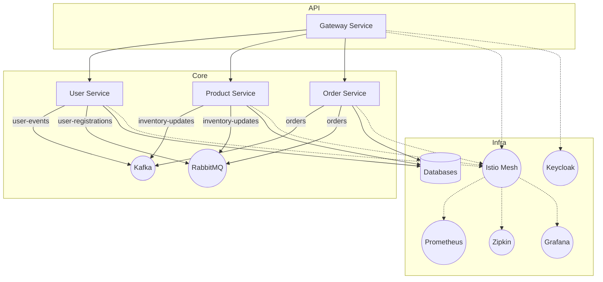

# E-Commerce Microservices Platform

## 🚀 Elevator Pitch
A production-grade, event-driven Java/Spring Boot e-commerce platform built with microservices, supporting distributed transactions, CQRS, service mesh, and global scale. Features include secure APIs, resilient patterns, real-time event flows (Kafka/RabbitMQ), observability, and automated CI/CD for cloud-native deployments.

## 📑 Table of Contents
- [Architecture](#architecture)
- [Prerequisites](#prerequisites)
- [Setup & Installation](#setup--installation)
- [Usage Examples](#usage-examples)
- [CI/CD & Deployment](#cicd--deployment)
- [Metrics & Observability](#metrics--observability)
- [Contributing](#contributing)
- [Code of Conduct](#code-of-conduct)
- [License](#license)

## 🏗️ Architecture


## 🛠️ Prerequisites
- Java 17+
- Maven 3.8+
- Docker & Docker Compose
- kubectl & Kubernetes cluster
- istioctl (v1.18.2)
- Helm (for Prometheus/Grafana)
- jq (for validation scripts)

**Environment Variables:**
- `DOCKERHUB_USERNAME`, `DOCKERHUB_TOKEN` (for CI/CD)
- `SPRING_PROFILES_ACTIVE` (e.g., `k8s`)
- `KAFKA_BOOTSTRAP_SERVERS`, `RABBITMQ_HOST`, `RABBITMQ_PORT`
- `KEYCLOAK_URL`, `KEYCLOAK_REALM`, `KEYCLOAK_CLIENT_ID`

## ⚡ Setup & Installation
1. **Clone the repo:**
   ```sh
   git clone https://github.com/PraxisForge/ecommerce-microservice.git
   cd ecommerce-microservice
   ```
2. **Start Kafka, RabbitMQ, Schema Registry:**
   ```sh
   docker-compose up -d
   ```
3. **Start Keycloak:**
   ```sh
   docker run -d --name keycloak -p 8080:8080 -e KEYCLOAK_ADMIN=admin -e KEYCLOAK_ADMIN_PASSWORD=admin quay.io/keycloak/keycloak:24.0.1 start-dev
   # Configure 'ecommerce' realm and clients
   ```
4. **Install Istio:**
   ```sh
   ./scripts/install-istio.sh
   ./scripts/validate-sidecar.sh
   ```
5. **Install Prometheus & Grafana:**
   ```sh
   helm repo add prometheus-community https://prometheus-community.github.io/helm-charts
   helm repo add grafana https://grafana.github.io/helm-charts
   helm repo update
   helm install prometheus prometheus-community/prometheus
   helm install grafana grafana/grafana
   ./scripts/port-forward-observability.sh
   ```
6. **Build & Deploy Services:**
   ```sh
   mvn clean package
   # Build/push Docker images and deploy to K8s (see CI/CD section)
   ```

## 📚 Usage Examples
- **REST API:**
  ```sh
  curl -X POST http://<gateway-host>/api/orders -H "Authorization: Bearer <token>" -d '{"userId":"u1","total":100.0}'
  curl http://<gateway-host>/api/products
  ```
- **Event Flow:**
  - Order creation emits `OrderCreatedEvent` to Kafka and RabbitMQ.
  - SagaCoordinator orchestrates payment/inventory, emits compensating events on failure.
- **Mesh Routing:**
  - Canary deploy: 90% traffic to v1, 10% to v2 of product-service via Istio VirtualService.

## 🚀 CI/CD & Deployment
- **GitHub Actions:** Automated build, test, Docker image push, and K8s deploy via `.github/workflows/ci-cd.yml`.
- **Manual K8s Deploy:**
  ```sh
  kubectl apply -f k8s/
  kubectl apply -f istio/
  kubectl apply -f cloud/
  ```
- **Update images:**
  ```sh
  kubectl set image deployment/product-service product-service=<image>:<tag>
  ```

## 📈 Metrics & Observability
- **Distributed Tracing:** Zipkin via Sleuth/Zipkin integration.
- **Metrics:** Prometheus scrapes `/actuator/prometheus` endpoints.
- **Dashboards:**
  - Grafana: Import `istio/grafana-istio-dashboard.json`.
  - Kiali: Service mesh topology and traffic.
- **Port-forward:**
  ```sh
  ./scripts/port-forward-observability.sh
  # Grafana: http://localhost:3000
  # Kiali: http://localhost:20001
  ```

## 🤝 Contributing
- Fork the repo, create a feature branch, submit PRs.
- Follow code style and add tests for new features.
- See [CONTRIBUTING.md](CONTRIBUTING.md) for details.

## 🧑‍⚖️ Code of Conduct
- See [CODE_OF_CONDUCT.md](CODE_OF_CONDUCT.md)

## 📝 License
- [MIT License](LICENSE)
